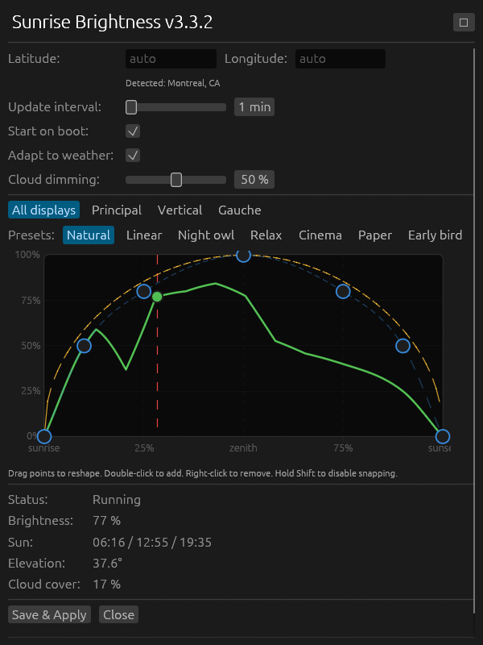

# Sunrise Brightness

Automatically adjusts your screen brightness throughout the day based on the sun's position. Runs in the system tray and adapts to weather conditions.



## Features

- **Solar-powered brightness**: uses the NREL Solar Position Algorithm (±0.0003°) to compute precise sunrise, sunset, and solar elevation for your location — no API key needed
- **Weather adaptation**: dims your screens when it's cloudy or rainy using Open-Meteo's free forecast (no API key)
- **Interactive curve editor**: drag control points to customize your brightness profile, with 7 presets (Natural, Linear, Night Owl, Relax, Cinema, Paper, Early Bird)
- **Per-monitor support**: set each display to follow the global curve, apply an offset, use a fully custom curve, or be ignored entirely
- **System tray**: runs silently in the background, opens a settings panel on click
- **Auto-start**: optional launch on boot
- **Auto-update check**: notifies you when a new version is available on GitHub

## Installation

### Linux (.deb)

Download the `.deb` from the [latest release](https://github.com/Vianpyro/sunrise-brightness/releases/latest) and install:

```bash
sudo dpkg -i sunrise-brightness_*.deb
```

This automatically installs the binary to `/usr/bin/` and pulls in runtime dependencies.

### Linux (manual binary)

Download the binary from the [latest release](https://github.com/Vianpyro/sunrise-brightness/releases/latest), then:

```bash
# Install runtime dependencies
sudo apt install libgtk-3-0 libxdo3 libappindicator3-1 libssl3

# Install the binary
sudo install -m 755 sunrise-brightness-linux /usr/local/bin/sunrise-brightness

# Run it
sunrise-brightness
```

### Windows

Download `sunrise-brightness-windows.exe` from the [latest release](https://github.com/Vianpyro/sunrise-brightness/releases/latest) and run it. No installation needed, the binary is self-contained.

## Configuration

Settings are stored in a TOML file at the platform-appropriate config directory:

| Platform | Path                                              |
| -------- | ------------------------------------------------- |
| Linux    | `~/.config/sunrise-brightness/config.toml`        |
| Windows  | `%APPDATA%\sunrise-brightness\config\config.toml` |

All settings can be changed through the GUI. Example config:

```toml
latitude = 45
longitude = 0
update_interval_secs = 180
start_on_startup = true
weather_adaptive = true
cloud_attenuation = 0.5

[global_curve]
preset = "natural"
[[global_curve.points]]
position = 0.0
brightness = 0.0
# ... more points
```

If `latitude`/`longitude` are omitted, your location is auto-detected from your IP address.

## Building from source

```bash
# Linux: install build dependencies
sudo apt install build-essential pkg-config libgtk-3-dev libappindicator3-dev libxdo-dev libssl-dev libwayland-dev

# Build
cargo build --release

# The binary is at target/release/sunrise-brightness
```

## Build verification

All release binaries include [SLSA build provenance attestations](https://slsa.dev/). You can verify any binary with:

```bash
gh attestation verify sunrise-brightness-linux --repo Vianpyro/sunrise-brightness
```
